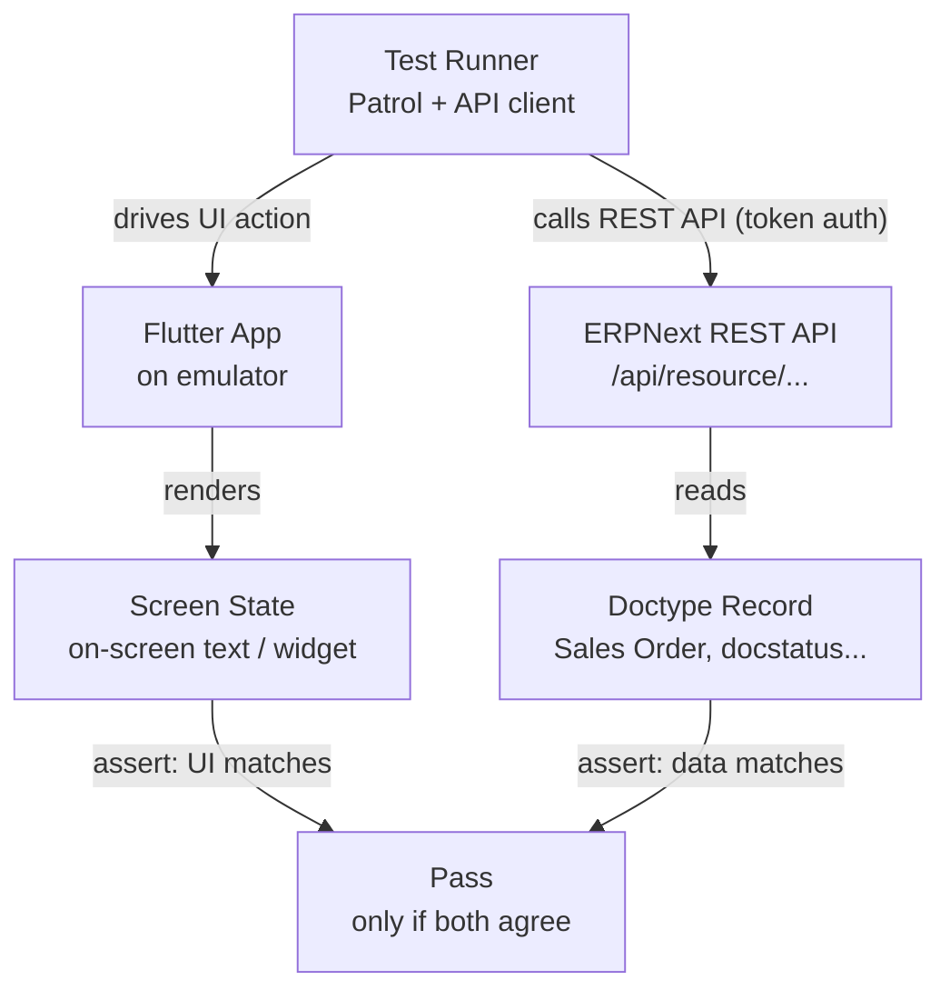
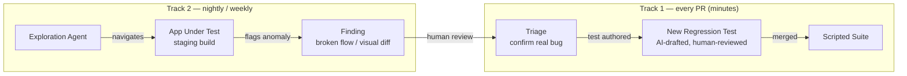

# AI-Assisted UI/UX Testing — Architecture

**Scope:** Flutter app · ERPNext REST backend · token-based API auth
**Status:** Draft — implementation in progress

## How to use this document

This is the spec for the app's testing setup. It's meant to be implemented incrementally, in the order laid out in [Rollout](#rollout). When asked to "build on the testing architecture" or similar, start from the first milestone your project hasn't completed yet, unless told otherwise.

**If this file reached you via the `testing-standards` submodule** ([source repo](https://github.com/wahni-green/mobile-testing-standards)), don't check the Rollout boxes below in place — that edit only lives in your local submodule checkout and isn't a meaningful record of anything. Track your own project's milestone progress separately (a short `TESTING_ROLLOUT.md` at your project root, or your issue tracker); see the submodule README for details.

Two tracks, not one tool:

- **Track 1 — scripted regression suite.** Deterministic flows that run on every PR. AI's role here is authoring and maintenance (generating tests, repairing broken selectors) — not deciding pass/fail at runtime.
- **Track 2 — exploratory agent.** Drives the app by intent rather than script, runs on a slower cadence, and its findings go through human triage before becoming permanent Track 1 tests.

Track 2 feeds Track 1 over time; Track 1 carries the day-to-day weight of gating merges.

Separate from both tracks: **[TESTING_BASELINE.md](TESTING_BASELINE.md)** is not scheduled work — it's the minimum that should exist before Milestone 1a ships, on every project that starts from this file. It covers formatting/locale consistency, interaction idempotency (double-tap, search debounce), device & session integrity (dev-mode/mock-location/root detection, secure token storage), input validation, document-state and schema resilience, attachments, accessibility, stability, and a conditional set (offline queueing, barcode scanning, notifications, multi-company, localization) for projects that need them.

Also separate from both tracks: **[TESTING_LESSONS_LEARNED.md](TESTING_LESSONS_LEARNED.md)** — real-world CI and E2E gotchas from past rollouts (emulator/simulator CI infra, resilient E2E patterns, backend cross-check pitfalls, debugging methodology). Worth a skim before starting Milestone 1b's CI wiring, or any time a scripted E2E suite goes flaky.

---

## The core mechanism: never trust the screen alone

ERPNext is the source of truth. Every scripted flow should assert **twice** — once against what the app renders, once against what ERPNext actually recorded — because a screen that says "Order submitted" but never persisted the Sales Order is a real bug that a UI-only assertion would miss.



**Why this order:** UI-only assertions catch rendering bugs; API-only assertions catch logic bugs. Neither alone catches a screen that lies about what the backend did — the failure mode that most erodes trust in an app that's just a client over REST.

---

## Track 1 — the regression safety net

Runs on every PR. Has to be fast, deterministic, and cheap to keep in sync with the app.

| Layer | Tool | Purpose |
|---|---|---|
| API / contract | Direct REST calls | Validate ERPNext business logic and doctype rules without UI flakiness |
| Widget / integration | `flutter integration_test` | Fast, in-process checks of a single screen or widget tree |
| End-to-end flow | [Patrol](https://patrol.leancode.co/) | Real gestures, permission dialogs, native pickers, background/foreground transitions |
| Device execution | Firebase Test Lab | Android + iOS device matrix, parallelized, disposable |
| Orchestration | GitHub Actions | Triggers the matrix on every PR, publishes logs/video/screenshots as artifacts |

### Where AI helps in this track

- **Test generation from ERPNext schema.** A doctype's fields, mandatory rules, and permission levels are enough to draft API-layer contract tests automatically.
- **Test generation from flow descriptions.** "Create a Sales Order for an existing customer and confirm it appears in the order list" becomes a Patrol test plus its API cross-check, drafted for human review.
- **Self-healing selectors.** When a widget key or label text shifts, propose the updated locator instead of leaving the test red.

### The cross-check pattern in practice

```dart
testWidgets('creating a Sales Order updates ERPNext', (tester) async {
  // drive the UI
  await patrol.tap(find.byKey('new_sales_order'));
  await patrol.enterText(find.byKey('customer_field'), 'Acme Co');
  await patrol.tap(find.byKey('submit_button'));
  await patrol.waitUntilVisible(find.text('Order submitted'));

  // cross-check against the source of truth, not just the screen
  final order = await erpnext.get(
    '/api/resource/Sales Order',
    params: {'filters': '[["customer","=","Acme Co"]]'},
    token: testUserToken,
  );
  expect(order.data.length, 1);
  expect(order.data.first['docstatus'], 1); // submitted
});
```

---

## Track 2 — the exploratory layer

Runs nightly/weekly against a staging build. Points an agent at the app with no fixed path and treats anything it finds as a lead, not a verdict.

| Approach | How it navigates | Best for |
|---|---|---|
| Accessibility-tree agent | Reads the semantic tree, acts by role/label | Fast, reliable — works well once Flutter widgets carry real semantic labels |
| Vision / computer-use agent | Reads screenshots, acts on pixel coordinates | Catches purely visual problems the semantic tree can't see |
| Visual regression diffing | Pixel/layout diff against golden screenshots | Layout and style drift across releases; run alongside either agent |



**Why triage stays human:** an exploration agent will occasionally misread its own screenshot or hit a genuinely ambiguous state and call it a bug. Auto-filing or auto-merging findings trades a false-negative problem (bugs you miss) for a false-positive problem (noise that trains the team to ignore the tool) — worse in practice.

---

## Test data & environment

- **Dedicated staging site.** Tests run against an ERPNext instance that exists only for this purpose — never production, ideally not shared with manual QA either, since concurrent writes cause flakiness unrelated to the app.
- **Seed and tear down via API.** Each run creates the customers/items/records it needs through the same REST API the app uses, and deletes them after. The suite should be runnable twice in a row with no manual reset.
- **Scoped, rotating tokens.** Test users get tokens with only the permissions a real end-user role would have, stored as CI secrets, rotated on a schedule — never the admin token used for staging setup.

---

## Rollout

- [ ] **0 (wk 0–1)** — [TESTING_BASELINE.md](TESTING_BASELINE.md) scaffolded: shared `AppDateFormatter`, `AsyncActionButton`, `DeviceIntegrityService`, secure token storage, and their tests under `test/baseline/`. *Exit: baseline suite green and wired as a required CI check, independent of any feature.*
- [ ] **1a (wk 1–2)** — API contract tests for the top 5 doctypes/workflows. *Exit: runs in CI on every PR.*
- [ ] **1b (wk 3–5)** — Patrol E2E for 3–5 critical journeys, with API cross-verification. *Exit: green on Android + iOS emulators in CI.*
- [ ] **1c (wk 6–8)** — AI-assisted authoring from flow descriptions; visual regression baseline. *Exit: new flow → merged test in under a day.*
- [ ] **2a (wk 9–11)** — Exploration agent runs nightly against staging. *Exit: first triaged findings converted into regression tests.*
- [ ] **2b (ongoing)** — Feedback loop tuned; coverage tracked over time. *Exit: exploration findings feed Track 1 weekly.*

---

## Honest tradeoffs

- **Flake.** Emulator flakiness produces false failures. Fix with retries and a quarantine list for known-flaky tests — never by deleting the inconvenient assertion.
- **Noise.** An exploration agent with no human triage step will eventually cry wolf and get ignored. Keep triage in the loop even once the agent seems reliable.
- **Drift.** AI-authored tests can drift from what the flow actually intends if nobody reads the diff. Review generated tests exactly like any other PR — the model drafts, a person signs off.
- **Blast radius.** Token scoping and a dedicated staging site keep a bad test run contained to that instance alone — confirm this before Track 2 goes live, not after.

---

## Stack summary

| Concern | Choice |
|---|---|
| Baseline invariants | See [TESTING_BASELINE.md](TESTING_BASELINE.md) — `lib/shared/` components + `test/baseline/`, required CI check, independent of feature work |
| API contract tests | REST calls direct to ERPNext, token auth |
| Widget/integration tests | `flutter integration_test` |
| E2E flow automation | Patrol |
| Device execution | Local emulators (dev) · Firebase Test Lab (CI) |
| CI orchestration | GitHub Actions |
| Exploratory agent | Accessibility-tree or vision-based navigation, human-triaged |
| Visual regression | Golden-image diffing, run alongside Track 2 |
